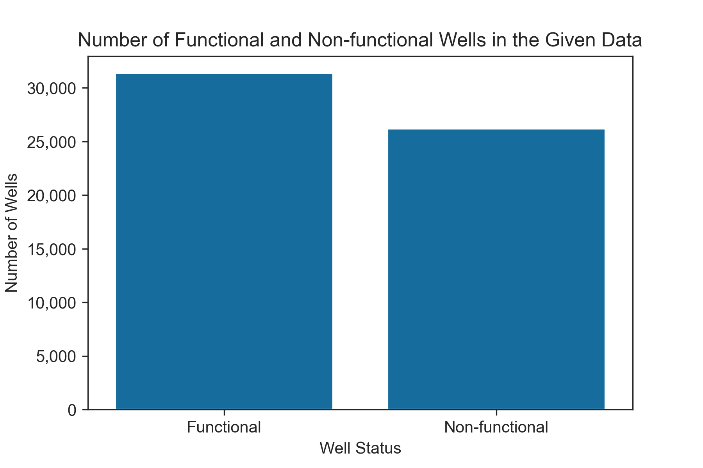
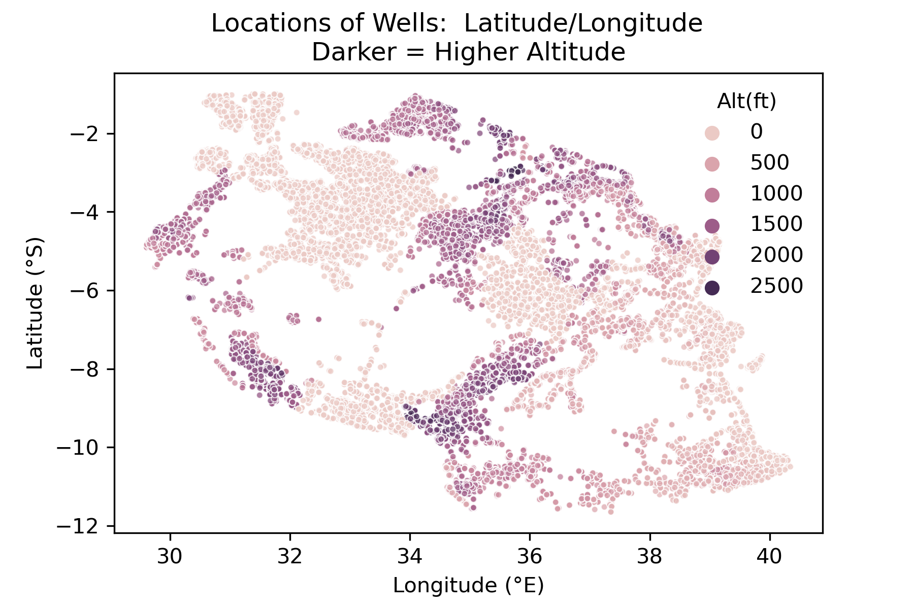
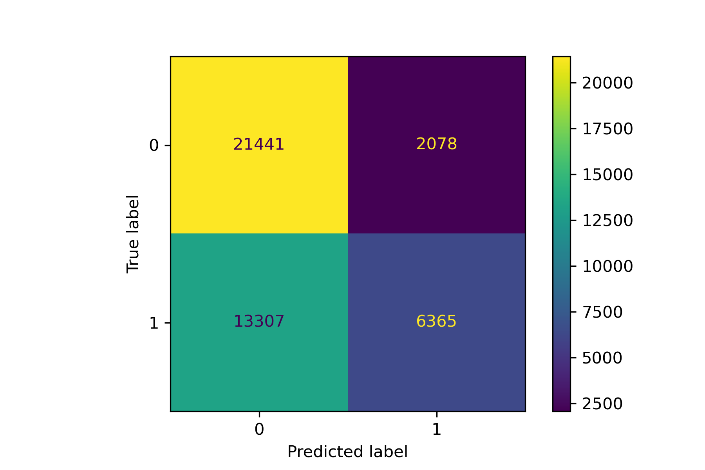

# Modeling Water Wells in Tanzania

Project by Kelsey Lane, Andy Schmeck, and Ted Brandon

This repository has been created to present a data analysis approach to helping an NGO predict failure of water wells in Tanzania.  This document is intended to bridge the gap between technical and non-technical audiences.


## Overview
This project uses data about Tanzanian wells available at [DrivenData](https://www.drivendata.org/competitions/7/pump-it-up-data-mining-the-water-table/). Our model seeks to classify wells as functional or not in order to help a non-government organization (NGO) determine which wells they need to repair. After the data were cleaned, various iterative classification models were run in order to identify a model that has the best mix of a high precision and low complexity. We found that the amount of total static head (tsh) of the well, alongside its installer, extraction type, and if it had a government permit, were all significant predictors in classifying the functionality of a well with 75% precision.

## Business Understanding
An NGO seeks to help Tanzania accomplish its' Millennium Development Goal 7C: "halving the proportion of the population without sustainable access to safe drinking water," ([MDG report](https://commonwealthfoundation.com/wp-content/uploads/2013/10/MDG%20Reports%20Tanzania_FINAL_2.pdf)). Tanzania's situation is dire ([World Bank](https://reliefweb.int/sites/reliefweb.int/files/resources/120166.pdf)) as only 60% of Tanzanians can get their drinking water from an improved source. On top of that as of 2014, 40% of the 83,000 rural water points were found to be non-functional with the likelihood of failure at 20% during their first year of operation. Bolstering water supply, sanitation, and hygiene conditions is a pain point of importance for Tanzania as these conditions have been linked with improved human development, reduced poverty, and reduced stunting in early childhood.



46% of the wells in Tanzania are in need of repair or nonfunctioning. Instead of building new wells, an NGO can drastically increase clean water supply by simply fixing wells. The urgency of the situation, and an NGO's financial constraints, increase the need for precision in our model. Sending an NGO out to a fully-functional well would be expensive and cost the opportunity of fixing an actual nonfunctioning well. This problem may be exacerbated since some of these wells are very remote and in mountainous regions, hence the focus on precision for evaluating the model. By using our model, the NGO can preemptively address probable pump failures and increase the sustainable, improved well capacity of Tanzania.

## Data
The data used in this analysis is provided by [Tanzania's Ministry of Water](https://www.maji.go.tz/) and compiled by [Taarifa](https://taarifa.org/) available at [DrivenData](https://www.drivendata.org/competitions/7/pump-it-up-data-mining-the-water-table/). The dataset includes information on 59,400 wells, each of which has 41 different features. The target column, `status_group`, indicates if the well is *functional*, *in need of repair*, or *non-functional*. We are able to use the features provided about each well to build a classification model to predict the status of the well, and thus help the NGO determine which wells of unknown status may or may not need repairs. In this case the wells in need of repair and the ones that are non-functional are grouped together as they would require some kind of attention. Finally, this data spans from 2003-2013 and thus any contextual information is limited to 2013 in order to accurately reflect the state of the country at the time the data was collected. A visualization of all the data points and their location in the country can be seen in the map below.



There is a lot of overlap in the original columns, such as `waterpoint_type` and `waterpoint_type_group`, or `extraction_type`, `extraction_type_group`, and `extraction_type_class`. As a result, the original dataset was paired down to only include relevant columns that present unique information. Any remaining null values were appropriately handled and any impossible or incorrect data points were also dealt with. Furthermore, a column representing the season the status of the well was checked in was also included as an additional engineered feature.

## Modeling
The first simple model used was a decision tree with a small depth that helped identify important columns of significance to better pair down the features fed into the model. These key features are `amount_tsh`, `installer`, `extraction_type_class`, and `permit`. The final model we went with was a logistic regression as the more complex models performed at the same level, and therefore the logistic regression was chosen as it has the least computational load while producing the same results. This final model has a precision of 75% and an accuracy  of 64%. The confusion matrix for this can be seen below.



## Evaluation
To reiterate from earlier, we have been using precision as our metric; we want to avoid false positives. In this case, false positives are wells that we identify as needing attention when they are actually fully functional, as this would waste resources for the NGO. As a result, the 75% precise logistic regression was our final model. While this is less than the precision of the original decision tree, this model is less computationally strenuous and therefore comparatively easier for the NGO to implement. Through using this model, the NGO could help identify wells in need of repair or replacement and better allocate their resources without wasting time checking up on functional wells.

## Conclusion
Overall, we would recommend the NGO consider using this model to help them predict which wells to focus their resources on. We would also recommend that if they have any interest in lobbying for better well construction in the future, they focus in on the total static head of the well, the installer, extraction type, and if the well has a government permit, as these were the most important features in predicting well failure. Knowing that NGOs often work under tight budget constraints, we would also love to model cost (well parts, replacement, transportation, etc) to help reduce risk of the organization. Finally, we would also like to partner with the NGO in disseminating educational materials and instruction on well maintenance, to impower local communities to increase the sustainability of these improved water sources. 

## More information
For the full code you can view the notebook [here](https://github.com/kelsklane/Tanzanian_Well_Prediction/blob/main/Tanzania_Well_Prediction.ipynb) or see the slidedeck for the presentation [here](https://github.com/kelsklane/Tanzanian_Well_Prediction/blob/main/Phase%203%20Presentation.pdf). You can also see the deployment of the model through Heroku [at this link](https://stormy-tor-88371.herokuapp.com).

### Project Structure
```bash
├──.gitignore
├──Phase 3 Presentation.pdf
├──README.md
├──Tanzania_Well_Prediction.ipynb
├──data
├──Images
├──Individual_Jupyters
    ├──Archived
    ├──Kelsey_Workbook.ipynb
```
